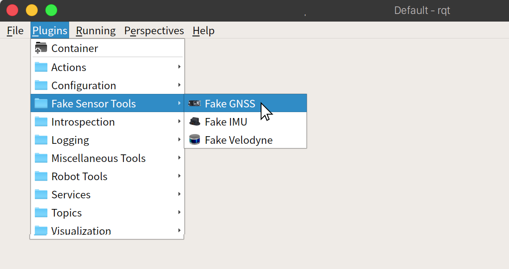
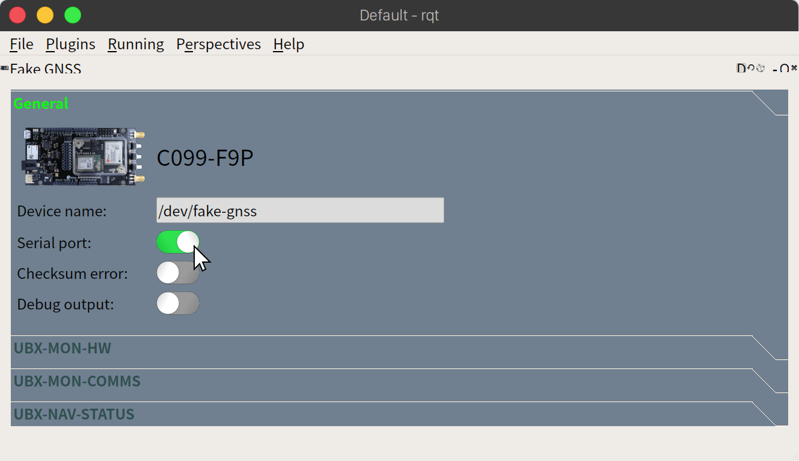
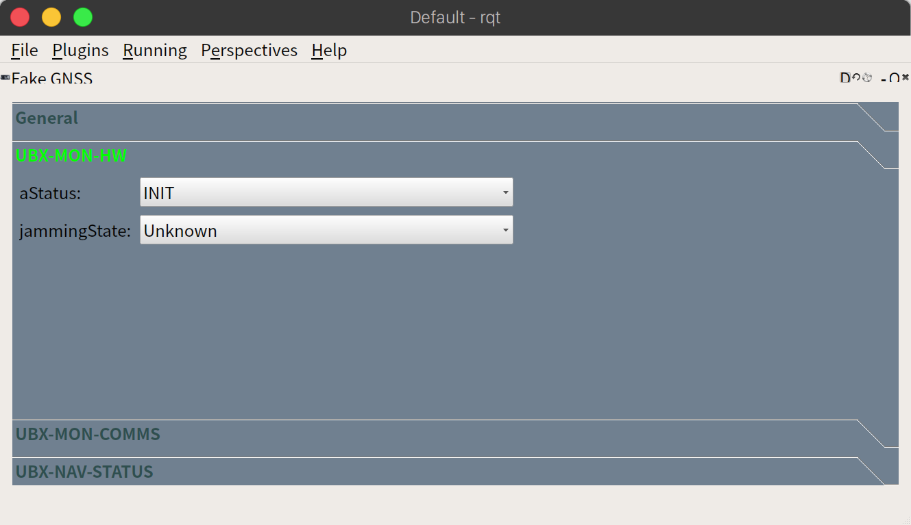
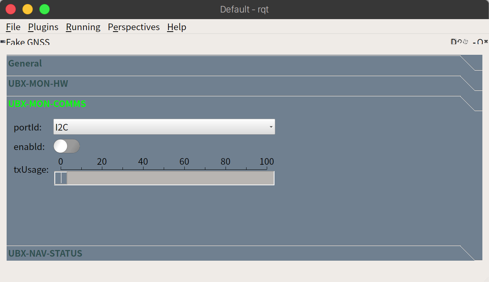
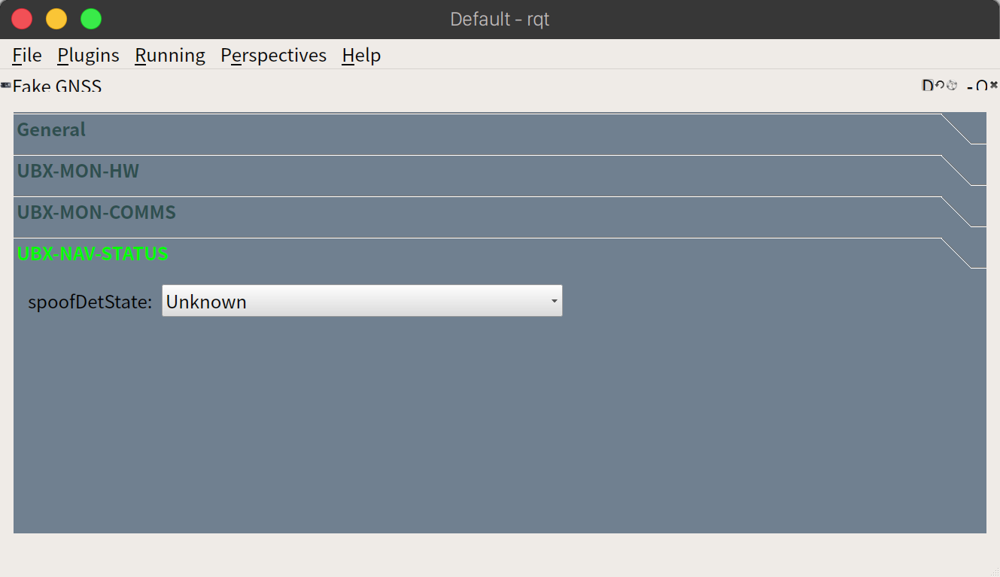

# Fake GNSS for Autoware

## Instructions

1. Create virtual serial ports

```
sudo socat -d -d pty,raw,echo=0,link=/dev/fake-gnss,mode=666 pty,raw,echo=0,link=/dev/gnss,mode=666
```

2. Enable Fake GNSS plugin.

- Choose from the menu: `Plugins`->`Fake Sensor Tools`->`Fake GNSS`
  

- Then, turn on the switch of `Serial port` to open serial port and transmit data.
  

3. Launch sensor driver.

```
roslaunch src/autoware/launcher/sensing_launch/launch/gnss.launch
```

Then transmission will be started.

---

## `General` page

| Field            | Description                           | Notes                                                          |
| ---------------- | ------------------------------------- | -------------------------------------------------------------- |
| `Device name`    | Device name associated with Fake GNSS | Normally, you do not need to edit this field.                  |
| `Serial port`    | Open/Close serial port                |                                                                |
| `Checksum error` | Enable/Disable checksum error         | The checksum value will be set to `??` if enabled.             |
| `Debug output`   | Enable/Disable debug output           | Transmission data can be seen in a terminal window if enabled. |

---

## `USB-MON-HW` page



| Field         | Description                                    | Notes                                                                                                                                                                                                   |
| ------------- | ---------------------------------------------- | ------------------------------------------------------------------------------------------------------------------------------------------------------------------------------------------------------- |
| `aStatus`     | Status of the antenna supervisor state machine | You can select status from the list.<br>[`INIT`, `DONTKNOW`, `OK`, `SHORT`, `OPEN`]                                                                                                                     |
| `jamminState` | Output from jamming/interference monitor       | You can select the status from the list.<br>[`Unknown`(or feature disabled), `OK` - no significant jamming, `Warning` - interference visible but fix OK, `Critical` - interference visible and no fix)] |

---

## `USB-MON-COMMS` page



| Field     | Description                                         | Notes                                                                                                         |
| --------- | --------------------------------------------------- | ------------------------------------------------------------------------------------------------------------- |
| `portId`  | Unique identifier for the port                      |                                                                                                               |
| `enabled` | Consolidate port information into transmission data | You can select port from the list.<br>[`I2C`, `UART1`, `UART2`, `USB`, `SPI`]<br>`USB` is enabled by default. |
| `txUsage` | Sets the sensor's internal spin rate                |                                                                                                               |

---

## `USB-NAV-STATUS` page



| Field           | Description              | Notes                                                                                                                                                  |
| --------------- | ------------------------ | ------------------------------------------------------------------------------------------------------------------------------------------------------ |
| `spoofDetState` | Spoofing detection state | You can select the status from the list.<br>[`Unknown` or deactivated, `No spoofing` indicated, `Spoofing` indicated, `Multiple spoofing` indications] |
