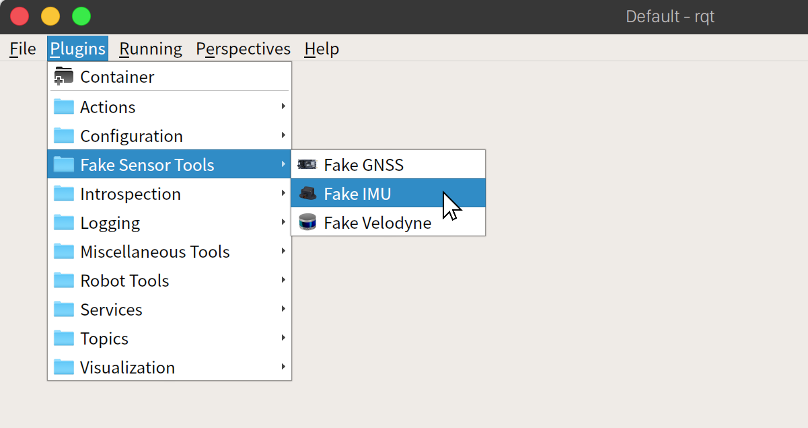
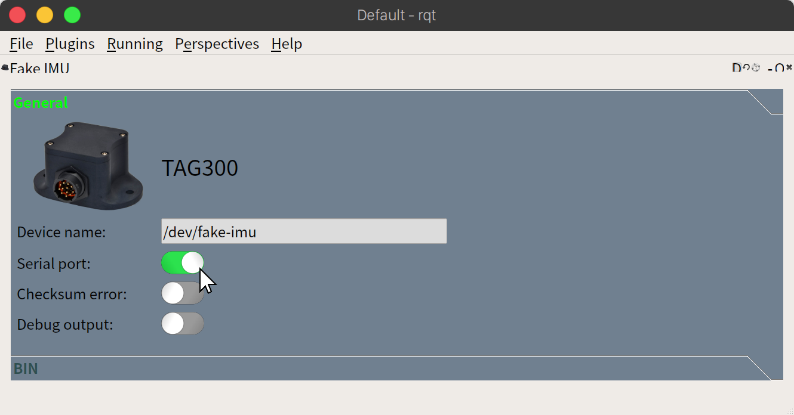
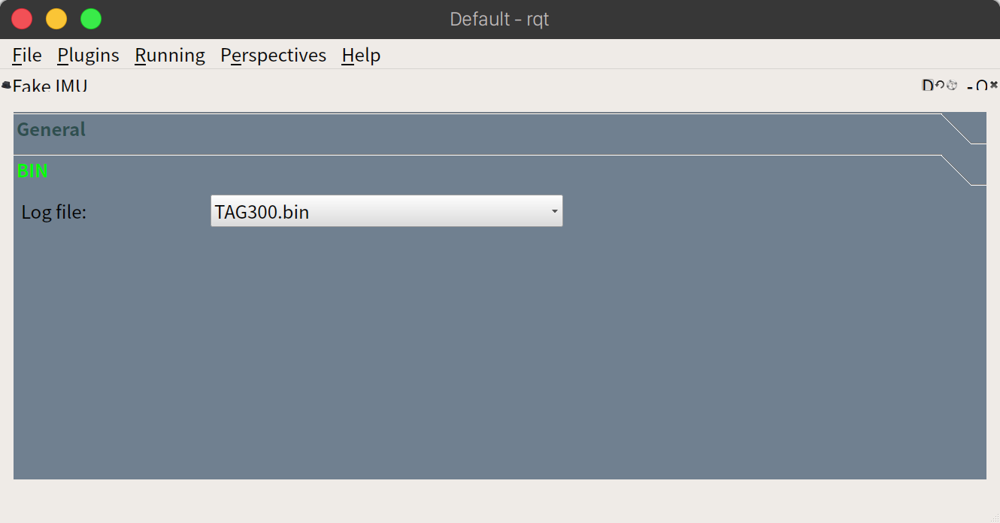

# Fake IMU for Autoware

## Instructions

1. Create virtual serial ports

```
sudo socat -d -d pty,raw,echo=0,link=/dev/fake-imu,mode=666 pty,raw,echo=0,link=/dev/imu,mode=666
```

2. Enable Fake IMU plugin.

- Choose from the menu: `Plugins`->`Fake Sensor Tools`->`Fake IMU`
  

- Then, turn on `Serial port` switch to open serial port and transmit data.
  

3. Launch sensor driver.

```
roslaunch src/autoware/launcher/sensing_launch/launch/imu.launch
```

Then transmission will be started.

---

## `General` page

| Field            | Description                          | Notes                                               |
| ---------------- | ------------------------------------ | --------------------------------------------------- |
| `Device name`    | Device name associated with Fake IMU | Normally, you do not need to edit this field.       |
| `Serial port`    | Open/Close serial port               |                                                     |
| `Checksum error` | Enable/Disable checksum error        | The checksum value will be set to `??` if enabled.  |
| `Debug output`   | Enable/Disable debug output          | Transmission data can be seen in a terminal window. |

---

## `BIN` page



| Field      | Description                                                              | Notes                                                                        |
| ---------- | ------------------------------------------------------------------------ | ---------------------------------------------------------------------------- |
| `Log file` | Log file, which contains BIN data,<br>to be transmitted to sensor driver | You can select log file from the list.<br>[`TAG300.bin`, `TAG300_error.bin`] |

- `TAG300.bin`<br>
  Normal log data.
- `TAG300_error.bin`<br>
  Log data when GNSS receiver is disconnected from IMU.
  Error bit in status bits will be set in a while.
