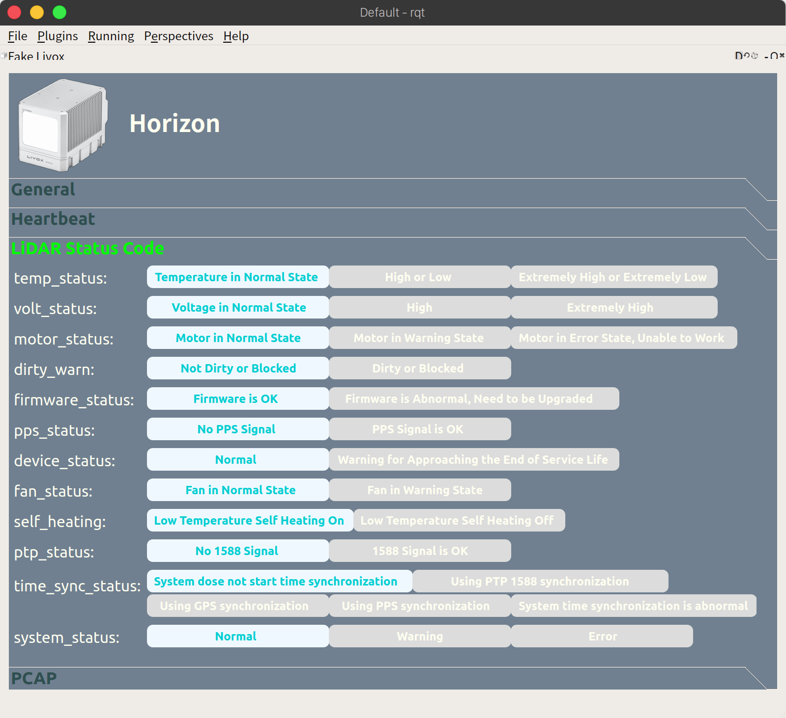
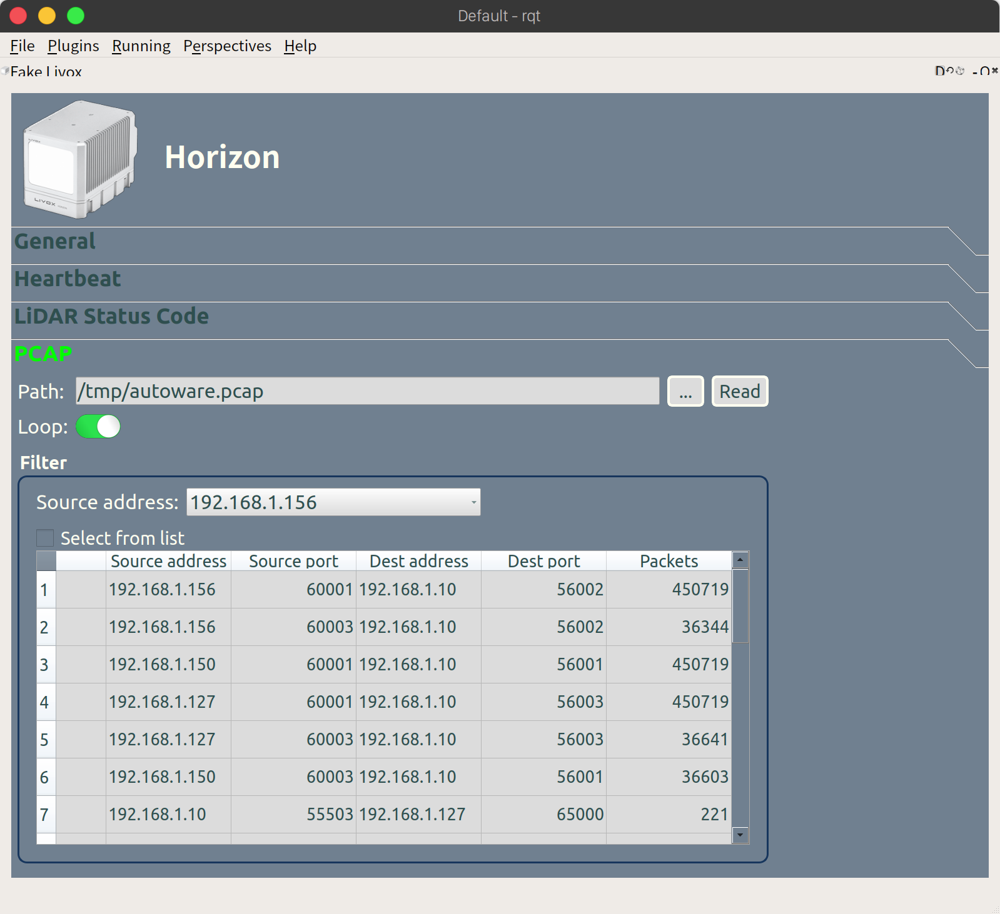
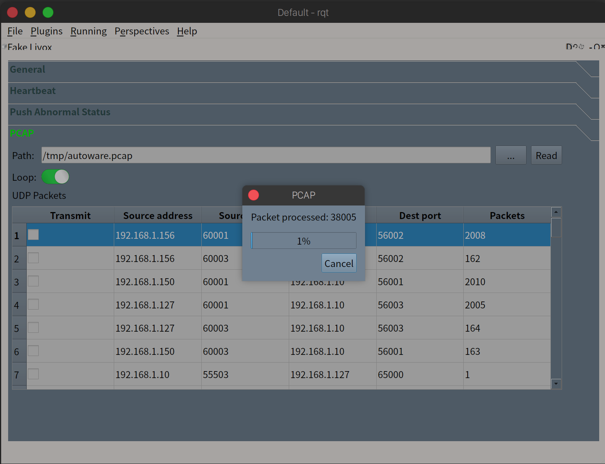
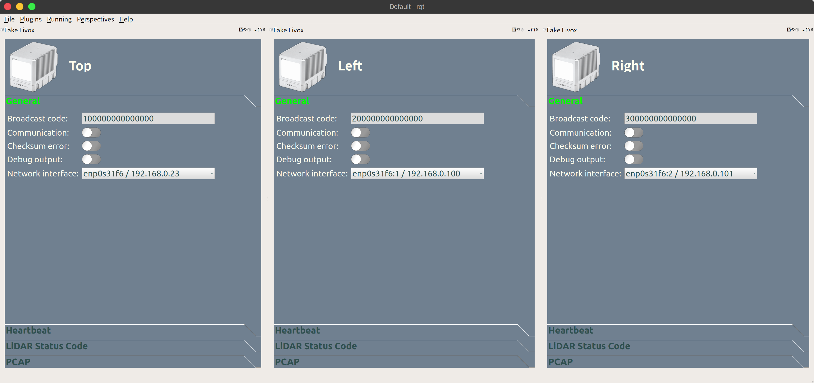
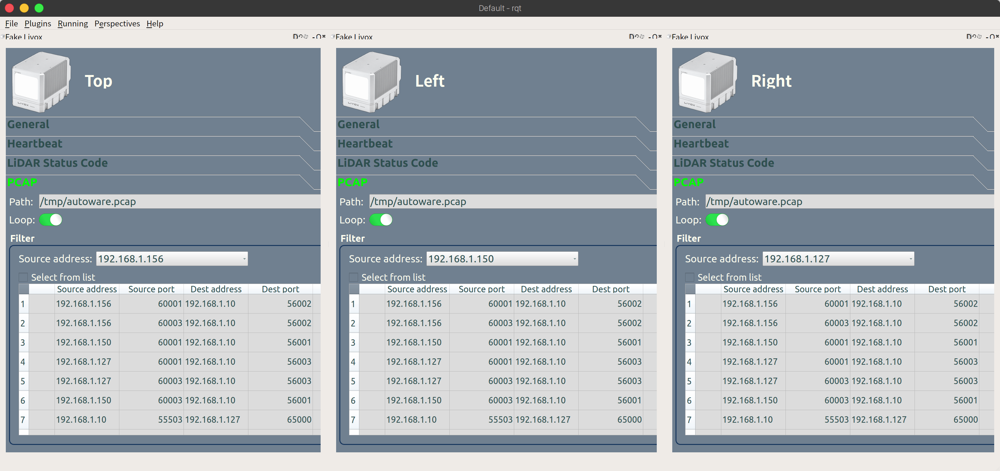
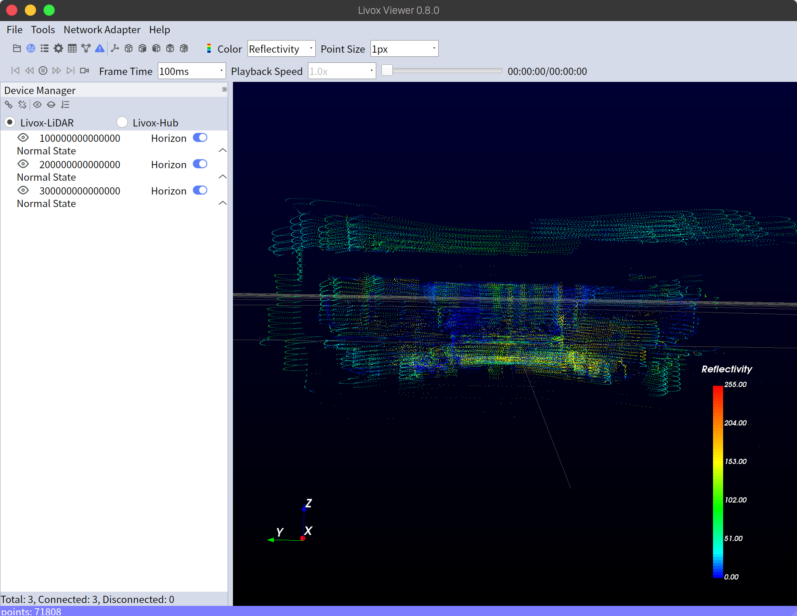

# Fake Livox for Autoware

## Instructions

1. Enable Fake Livox plugin.

- Choose from the menu: `Plugins`->`Fake Sensor Tools`->`Fake Livox`
  

2. Launch sensor driver.

```
roslaunch livox_ros_driver livox_lidar.launch
```

- or if you wish to see point cloud in rviz, type the following command.

```
roslaunch livox_ros_driver livox_lidar_rviz.launch
```

- or you can use Livox Viewer.
  - Download the app.<br>
    https://www.livoxtech.com/jp/downloads
  - Decompress downloaded file. Type the following command. For example, <br>

```
tar xvf Livox_Viewer_For_Linux_Ubuntu16.04_x64_0.8.0.tar.gz
```

- Run Livox Viewer, Type.

```
./livox_viewer.sh
```

3. Start communication with sensor driver.

- Specify any broadcast code in `Broadcast code` field.
- If you wish to transmit point cloud data and IMU data by using .pcap file,
  - Specify any .pcap file on `PCAP` page.
  - Specify source address or packets to transmit.
- Then, turn on `Communication` switch to start communication with Livox ROS Driver.
  

Then transmission will be started.

---

## `General` page

| Field               | Description                   | Notes                                                          |
| ------------------- | ----------------------------- | -------------------------------------------------------------- |
| `Broadcast code`    | Broadcast code                |                                                                |
| `Communication`     | Start/Stop communication      |                                                                |
| `Checksum error`    | Enable/Disable checksum error | The checksum value will be set to `??` if enabled.             |
| `Debug output`      | Enable/Disable debug output   | Transmission data can be seen in a terminal window if enabled. |
| `Network interface` | NIC/IP address to use         |                                                                |

---

## `Heartbeat` page


| Field                         | Description                 | Notes |
| ----------------------------- | --------------------------- | ----- |
| `Return Code`                 | Return Code                 |       |
| `LiDAR State`                 | LiDAR State                 |       |
| `Rain/Fog Suppression Switch` | Rain/Fog Suppression Switch |       |

### If LiDAR State is not `Initializing`

Status Code can be set using the settings of "Push Abnormal Status".

### If LiDAR State is `Initializing`


| Field                     | Description             | Notes |
| ------------------------- | ----------------------- | ----- |
| `Initialization Progress` | Initialization Progress |       |

---

## `LiDAR Status Code` page



| Field              | Description                       | Notes                                                                             |
| ------------------ | --------------------------------- | --------------------------------------------------------------------------------- |
| `temp_status`      | Temperature Status                |                                                                                   |
| `volt_status`      | Voltage Status of Internal Module |                                                                                   |
| `motor_status`     | Motor Status                      |                                                                                   |
| `dirty_warn`       | Dirty/Blocked Status              |                                                                                   |
| `firmware_status`  | Firmware Status                   |                                                                                   |
| `pps_status`       | PPS Status                        |                                                                                   |
| `device_status`    | Device Status                     |                                                                                   |
| `fan_status`       | Motor Status                      |                                                                                   |
| `self_heating`     | Self Heating Status               |                                                                                   |
| `ptp_status`       | PTP Status                        |                                                                                   |
| `time_sync_status` | Time synchronization Status       |                                                                                   |
| `system_status`    | System Status                     | This code will be set automatically according to the settings of above errors.\*1 |

\*1 Also, please refer to the following document.

- [Livox SDK Communication Protocol](https://github.com/Livox-SDK/Livox-SDK/wiki/Livox-SDK-Communication-Protocol)

## `PCAP` page

Point cloud data and IMU data can be transmitted by using .pcap file.



| Field              | Description                                                             | Notes                                                                                         |
| ------------------ | ----------------------------------------------------------------------- | --------------------------------------------------------------------------------------------- |
| `Path`             | Path of .pcap file                                                      |                                                                                               |
| `...`              | Button to select .pcap file                                             |                                                                                               |
| `Read`             | Read .pcap file and show packets information in `UDP Packets`           |                                                                                               |
| `Loop`             | Enable/Disable loop playback                                            |                                                                                               |
| `Source address`   | Source address filter to transmit packets                               | Point cloud and IMU data from this source address will be automatically filtered to transmit. |
| `Select from list` | Another packet filter option, you can specify UDP packets from the list |                                                                                               |
| list               | UDP packets information                                                 |                                                                                               |

### Select from list option

You can apply packet filter. Check a checkbox or double click a table row.<br>(All UDP packets will be transmitted if none is selected.)


\*Multicast packets are filtered, not shown in the list, and not forwarded to the port.

## Emulate multiple LiDARs

You can emulate multiple LiDARs in a single host.

1. Add alias network interface by using `ifconfig`.<br>
   Type the following command

```
sudo ifconfig <interface>:<alias> <address> netmask <netmask address>
```

like

```
sudo ifconfig enp0s31f6:1 192.168.0.100 netmask 255.255.255.0
```

2. Run RQt.

```
rqt
```

3. Add another Fake Livox plugin.

4. Specify title name.

   You can edit the text on the right of Livox image(text displayed as "Livox") so that it would be easier to understand which window is for which LiDAR.

   The following example is for 3 LiDARs.
   

5. Specify a broadcast code in `Broadcast code` field.
6. Select the aliased network interface from `Network interface`.
7. Read .pcap file.
8. Select source address from `Source address`.

   The following example is for 3 LiDARs.
   

   Here is an example for Livox Viewer.
   
