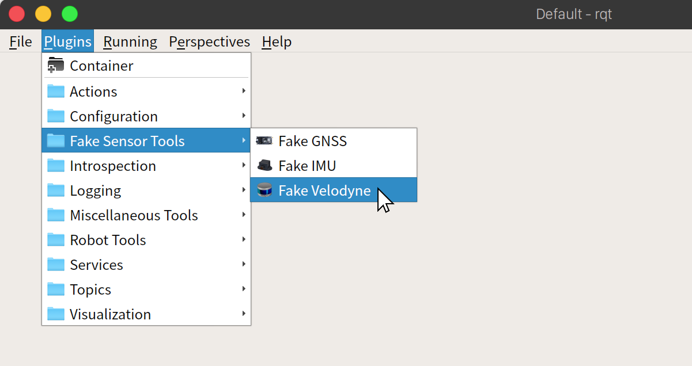
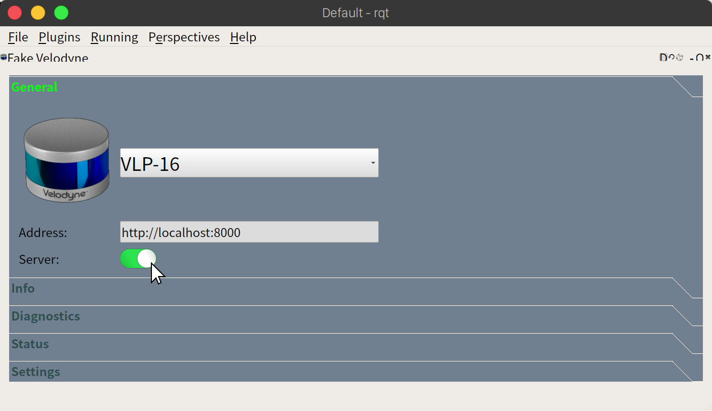
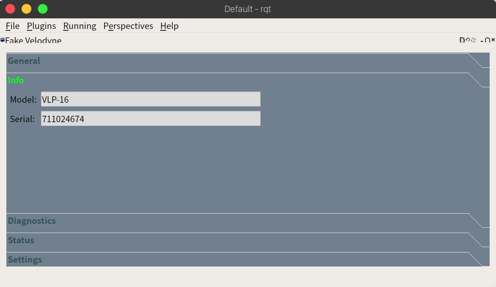
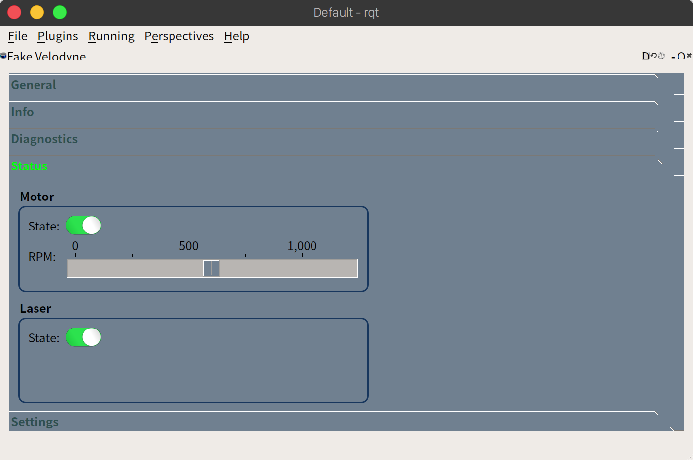
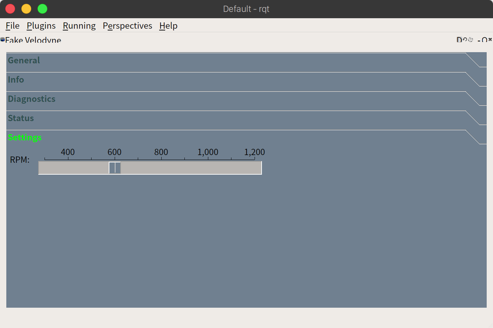

# Fake Velodyne for Autoware

## Instructions

1. Enable Fake Velodyne plugin.

- Choose from the menu: `Plugins`->`Fake Sensor Tools`->`Fake Velodyne`
  

- Specify any server address and port in `Address` field.
- Then, turn on `Server` switch to start server to receive HTTP request from a client.
  

2. Launch a client.

```
ros2 launch velodyne_monitor velodyne_monitor.launch.xml ip_address:='localhost:8000'
```

Then transmission will be started.

---

## `General` page

| Field                                        | Description                                           | Notes                                                                                                                      |
| -------------------------------------------- | ----------------------------------------------------- | -------------------------------------------------------------------------------------------------------------------------- |
| `Pulldown list`<br>on the right of the image | Sensor Model                                          | You can select model from the list.<br>[VLP-16, VLP-32C, VLS-128-AP]<br>This is refrected to `Model` field of `Info` page. |
| `Address`                                    | Server address and port associated with Fake Velodyne |                                                                                                                            |
| `Server`                                     | Start/Stop HTTP server                                |                                                                                                                            |

---

## `Info` page



| Field    | Description   | Notes |
| -------- | ------------- | ----- |
| `Model`  | Sensor Model  |       |
| `Serial` | Serial number |       |

---

## `Diagnostics` page


| Function                | Field     | Description                                         | Notes |
| ----------------------- | --------- | --------------------------------------------------- | ----- |
| `Top Board (Scaled)`    | `HV`      | High voltage bias to the APD (Avalanche photodiode) |       |
|                         | `Temp`    | Temperature of the top board                        |       |
|                         | `5v`      | Top board's 5.0 V rail                              |       |
|                         | `2.5v`    | Top board's 2.5 V rail                              |       |
|                         | `3.3v`    | Top board's 3.3 V rail                              |       |
|                         | `5v(raw)` | Top board's unregulated 5.0 V rail                  |       |
|                         | `Vcc`     | Top board's 1.2 V rail                              |       |
| `Bottom Board (Scaled)` | `I out`   | Sensor's input power line                           |       |
|                         | `1.2v`    | Bottom board's 1.2 V rail                           |       |
|                         | `Temp`    | Temperature of the bottom board                     |       |
|                         | `5v`      | Bottom board's 5.0 V rail                           |       |
|                         | `2.5v`    | Bottom board's 2.5 V rail                           |       |
|                         | `3.3v`    | Bottom board's 3.3 V rail                           |       |
|                         | `V in`    | Voltage of the input power                          |       |
|                         | `1.25v`   | Bottom board's 1.25 V rail                          |       |

---

## `Status` page



| Function | Field   | Description                                                  | Notes |
| -------- | ------- | ------------------------------------------------------------ | ----- |
| `Motor`  | `State` | Indicates if the sensor's internal motor is spinning: ON/OFF |       |
|          | `RPM`   | The sensor's current RPM                                     |       |
| `Laser`  | `State` | Turns the sensor's laser ON or OFF                           |       |

---

## `Settings` page



| Field | Description                          | Notes |
| ----- | ------------------------------------ | ----- |
| `RPM` | Sets the sensor's internal spin rate |       |
